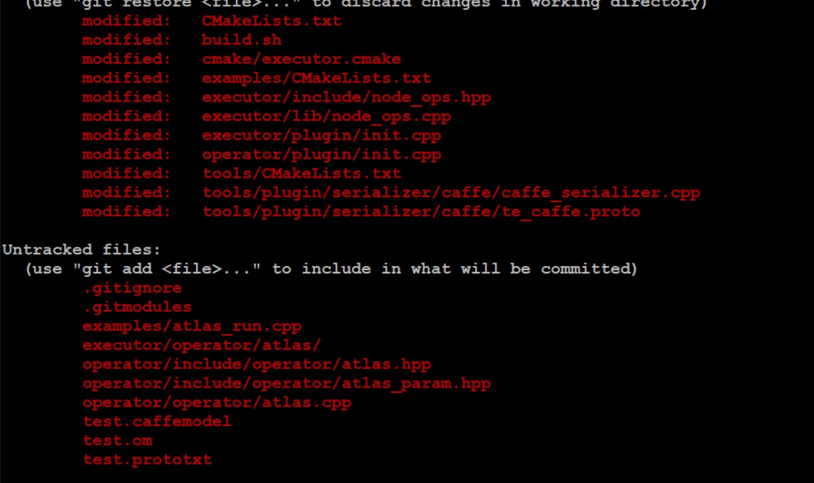

## Tengine 增加华为atlas npu做infer接口使用
## 只需prototxt配置就可完成CPU、NPU之间切换，多个模型之间串并联系

## 基于tengine的版本是git clone for tengine master 9f963f1db81b54ff59c3f980b240d275e1e1f12c

### 注册一个op为atlas, 插入到caffe model的prototxt中，atlas op会执行华为atlas加速卡
### 非atlas op的node依旧在服务器的CPU上执行，这样一个prototxt可以无缝在CPU和NPU之间切换

### 更方便的是一个prototxt里面可以包含多个子模型的无缝对接

### 类似扩展下去可以整洁的支持更多的NPU，目前只是那华为atlas试水

### Tengine 支持的算子 http://www.tengine.org.cn/jishu.php?class_id=102103

#### 贴一下增加一个op需要的改动，作为后来扩展的参考，sha1是9f3e0fae3137d420ff7afa8791ea77ec2b10d48f
#### https://github.com/wangshankun/Tengine_Atlas/commit/9f3e0fae3137d420ff7afa8791ea77ec2b10d48f

